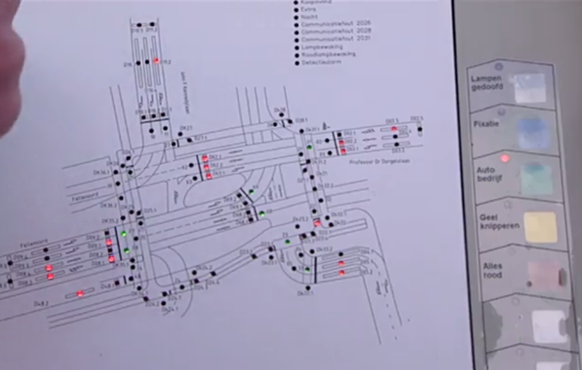
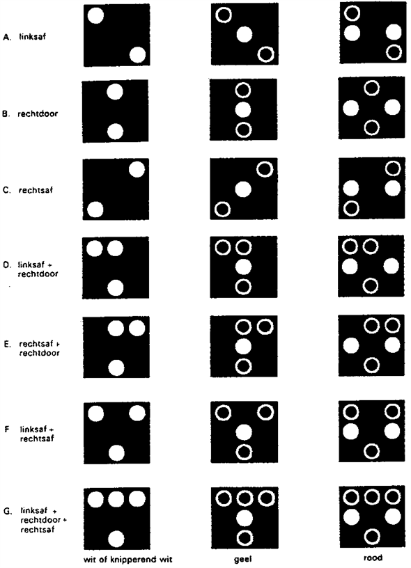
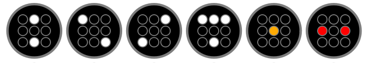

# Verkeers regels en afspraken

  Voorbeeld van een controller irl (Dit is niet een weergave van de betreffende kruispunt)

## Algemeen

*We spreken de verkeerslicht kleuren, wanneer niet geciteerd, aan met `red`, `green` en `amber`; `amber` is het licht dat over het algemeen wanneer er sprake is van een verkeersbord die uit drie verkeerslichten bestaat die zich tussen `red` en `green` bevind met een geel/orangje kleur.

### Wetten
43. Tweekleurige verkeerslichten mogen worden toegepast in situaties waarin slechts bepaalde verkeersstromen moeten worden gestopt en wel
    - op kruisingen en splitsingen van wegen nabij beveiligde overwegen en beweegbare bruggen. Alleen die richtingen, die de ontruiming van de overweg of de brug in de weg staan mogen worden voorzien van tweekleurige verkeerslichten;
    - in geval van automatische detectie van verkeersovertredingen;
    - in geval van automatische hoogtedetectie;
    - bij uitritten van hulpverleningsdiensten;
    - bij beweegbare bruggen in de plaats van bruglichten. In afwijking van het bepaalde in punt 39 zijn in dit geval de punten 9, 10, 12, 14, 17, 18, 19, 20, 21, 88, 89, 90, 97, 98 en 99 van overeenkomstige toepassing.
    
    In deze gevallen worden ten behoeve van het overige verkeer geen verkeerslichten toegepast.   In de ruststand van een dergelijke regeling zijn de lichten van de tweekleurige verkeerslichten gedoofd.
44. Tweekleurige verkeerslichten mogen voorts worden toegepast in situaties waarin een incidenteel voorkomende verkeersstroom onderling regelen van conflicterende verkeersstromen met verkeerslichten tijdelijk noodzakelijk maakt en wel
    - bij het oversteken van een weg of rijbaan door langzaam verkeer;
    - bij het oversteken of afbuigen van of naar een weg of rijbaan door openbaar vervoer;
    - bij het oversteken van een weg of rijbaan door ander verkeer bij zeer lage verkeersintensiteiten;
    - bij het gebruik van een uitrit door openbaar vervoer.
    
    In deze gevallen worden op de hoofdrichting tweekleurige verkeerslichten toegepast en op de zijrichting al naar gelang het geval driekleurige verkeerslichten, driekleurige fietslichten, voetgangerslichten, tram/bus-lichten dan wel een combinatie van deze lichten.
    
    Zolang zich geen verkeer op de zijrichting heeft gemeld zijn de lichten van de tweekleurige verkeerslichten gedoofd en wordt in de op de zijrichting geplaatste verkeerslichten het rode licht getoond.

45. In andere situaties dan genoemd in de punten 43 en 44 worden tweekleurige verkeerslichten niet toegepast.

## Auto's
### Verkeerslicht
| Behaviour | Meaning 
| --- | --- 
| Red | Stop 
| Amber | Stop; Persue if too close to come to a halt halt
| Amber Blinking | Out of order
| Green | Pursue

## Voetgangers / Fietsers
### Verkeerslicht
| Behaviour | Meaning 
| --- | --- 
| Red | Stop 
| Amber | Stop; Persue if too close to come to a halt halt
| Blinking Green | see `Amber`
| Green | Pursue

## Trein
Wanneer een trein over een trigger heen gaat, in dit geval betekend dit gespawned; volgt het volgende proces:
[een trein irl (YouTube)](https://youtu.be/8rTJjIsKTa0?t=27s)

| Relatieve tijd in seconden | Beschrijving
| --- | ---
| -27 | <ul><li>De trein wordt gespawned (de trein komt over de sensor)</li><li>De bellen luiden en rode lampen gaan knipperen</li></ul>
| -22 | De spoorovergangbomen dalen
| -10 | De spoorovergangbomen staan volledig horizontaal
| 0 | De trein heeft de overgang bereikt
| +`n` | <ul><li>De tijd wanneer het laatste contactpunt van de trein de spoorovergang heeft gepasseerd</li><li>De spoorovergansbomen gaan open</li></ul>
| +12+`n` | <ul><li>De spoorovergansbomen staan volledig verticaal</li><li>De lampen zijn gedoofd</li><li>De bellen zijn gestopt met luiden</li></ul>

### Verkeerslicht
`green` staat boven, `red` is beneden. (i.v.m. sneeuw)

| Behaviour | Meaning 
| --- | --- 
| Green | Pursue
| Red | Stop 
| Amber (blinking) / Blinking Green | Slow down (optionally a speed limit)

## Bus
### Wetten
56. De verkeerslantaarns van tram/bus-lichten zijn samengesteld uit twee, drie of vier witte lichten, een geel licht en twee rode lichten, die zijn aangebracht als aangegeven in bijlage II (Image above) behorende bij dit besluit.
59. De opsluitringen van de witte lichten moeten in grijs zijn uitgevoerd; die van de overige lichten in zwart.
68. Indien ter plaatse meerdere richtingen moeten worden geregeld wordt volstaan met één tram/bus-licht indien voor die richtingen altijd gelijktijdig wit, geel of rood licht wordt getoond. In andere gevallen wordt voor iedere richting dan wel gelijktijdig geregelde richtingen een afzonderlijk tram/bus-licht toegepast. Een en ander geschiedt overeenkomstig de afbeeldingen opgenomen in bijlage II (Image above), behorende bij dit besluit.
69. Indien aan rechtdoorgaand openbaar vervoer wit licht wordt getoond, moet aan kruisend en aan met een pijl geregeld, conflicterend verkeer rood licht worden getoond. Indien aan afbuigend openbaar vervoer wit licht wordt getoond, moet aan het verkeer dat wordt doorsneden, rood licht worden getoond.
70. Knipperend wit licht mag slechts worden toegepast in de volgende gevallen:
    - voor de onderlinge afwikkeling van openbaar vervoerbewegingen;
    - voor afslaande autobussen indien aan het rechtdoorgaande verkeer of afslaande verkeer, waaraan voorrang moet worden verleend, groen licht of geel licht wordt getoond;
    - indien de openbaar vervoerbeweging op een overigens geregelde kruising of splitsing van wegen een niet-geregelde voetgangersbeweging kruist.
71. De frequentie van het knipperend wit bedraagt 80 tot 120 onderbrekingen per minuut met een licht-donkerverhouding van 1:1.

### Verkeerslicht

 *De richting bij geel en rood wordt bepaald door de grijze ringen rond de lenzen van het witte licht

#### Kleurweergave

## Sources:
<https://nl.wikipedia.org/wiki/Verkeerslicht>  
<http://www.onlinetheorieles.nl/theorieboek/27.html>  
<http://wetten.overheid.nl/BWBR0009151/2010-03-31>  
<http://wetten.overheid.nl/BWBR0004825/2017-07-01>  
<http://www.nicospilt.com/index_overwegen.htm>  

